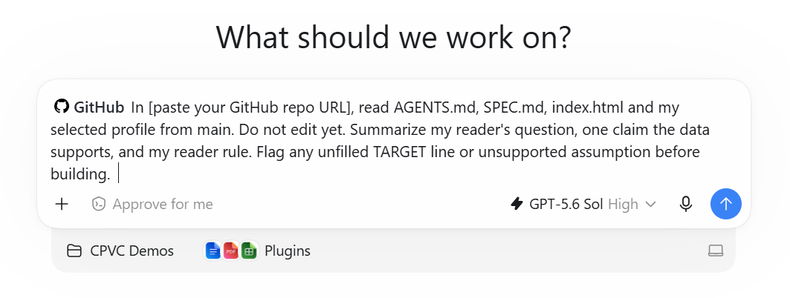

# Can someone understand what you built?

**The Understudy · Friday, September 11 · CPVC Session 02**

A recruiter sees filenames and counts, but cannot tell which project to ask about
or what it demonstrates. How could you help them understand the work honestly?

That is the problem. **You choose the reader, the question and what deserves to
lead.** An agent helps build your answer. You decide whether it ships.

[See Signal, the stretch example](https://calpolyvibecoding-01.github.io/cpvc-02-signal/).
Do not try to reproduce all its features today.

## The finish line

By 1 PM: one fictional profile, one specific reader, one supported claim, one
instruction-file rule followed, a reviewed change and a live link.

> [!NOTE]
> When you reach a **STOP**, wait there. We move as a room. Done early? Help
> the person next to you before moving on.

Bring a laptop and GitHub account. Lane A uses Codex on your personal ChatGPT
account, not Cal Poly's workspace.

> [!TIP]
> **No card or Codex access?** [Lane C](#lane-c-browser-fallback) needs no card,
> Codex access, download or API key. You still practice the same core lesson.

## 1. Make your own copy

**Use this template → Create a new repository**. Choose your account, name it
`cpvc-02-understudy`, choose **Public**, and copy only the default branch.
Keep last week's repo. No personal data.

In your copy: **Settings → Pages → Deploy from a branch → main → /(root) → Save**.
Open GitHub's displayed link after deployment. For a 404, check **Actions** and refresh.

---

> [!IMPORTANT]
> ## 🛑 STOP 1 · Your starter is live
>
> Do not move on until **your link opens and shows the starter**. It reports
> facts, not a recommendation. Need help? Ask an officer. Done? Check on a neighbor.

---

## 2. Decide before prompting

Choose one file: `profile-starter.json` (one new project), `profile-finance.json`,
`profile-software.json` or `profile-consumer.json`. All four are fictional.

Choose an approach, not a different curriculum track:

- **Analyzer:** What does this evidence support, and what should the reader ask next?
- **Showcase:** Which project should lead, and how would you explain its purpose?

Edit [SPEC.md](SPEC.md) with the pencil. Fill its **six TARGET lines**, then commit.
Name one person or situation, not “employers.” Missing data is a gap, not permission
to invent a purpose.

Edit [AGENTS.md](AGENTS.md): replace the reader-rule placeholder with one rule you
can check on screen. Commit it. SPEC is today's target; AGENTS is the standing brief.

> [!IMPORTANT]
> **Write the brief before you prompt.** All six TARGET lines and your AGENTS
> reader rule should be filled in and committed before the next step.

## 3. Let the understudy read the brief

### A. Connect your GitHub account

Keep **your GitHub repo** open. In Codex, use the **Plugins** entry in the left
pane. GitHub holds your files and the final review; Codex is where you brief the agent.

1. **Sign in to your personal ChatGPT account**, not the Cal Poly workspace.
2. Click **Plugins** in the left pane, search for **GitHub**, and open the GitHub
   plugin. Click **Install** (or the **+** install button). Do not wait for an
   automatic connection prompt when you open Codex.
3. Use the plugin's **Connect / Sign in** step and log in to the GitHub account
   that owns your copy from Part 1. Installing the plugin and signing in are
   separate steps; finish both.
4. GitHub will ask you to authorize or install the app. If it asks where to
   install, choose **your personal GitHub account**, not the club or a work
   organization. Check that you arrived here from Codex and review the permissions.
5. Under **Repository access**, choose **All repositories** for your club-building
   account. Complete the **Install / Authorize** prompts, then return to Codex.
   This avoids having to add each new weekly repo to the connection manually.

> [!WARNING]
> **Know what “All repositories” allows.** It covers the app's requested access
> across that account's current and future repos, including private ones. It does
> not make them public. If you keep sensitive or work projects there, choose
> **Only select repositories** and add `cpvc-02-understudy` instead. That still
> supports agentic work; you will need to add future club repos yourself.

### B. Start a task with GitHub and your repo

1. Return to Codex after sign-in and start a **new task** so the installed plugin
   is available. Type **@** and choose **GitHub** to include it in your request.
2. Paste the URL of **your username / cpvc-02-understudy**, not the club's template.
   Having access to every repo does not tell the agent which one you mean.
3. Use the read-only prompt below to check the committed files on **main**.
   This plugin path does not require you to create a Codex cloud environment.
   No API keys, secrets or packages are needed for the starter.

> [!TIP]
> **Plugin installed but not connected?** Go back to **Plugins → GitHub** and
> complete sign-in. Then start a new task with **@GitHub**.
>
> **Connected, but the agent cannot access your repo?** In GitHub, open your profile
> menu → **Settings → Applications → Installed GitHub Apps**. Find the app you
> connected from Codex, choose **Configure**, then check **Repository access**.
> Choose **All repositories**, or add your new repo to the selected list, and
> **Save**. Return to Codex and retry with your repo URL. These are account settings,
> not the repository's Settings tab. If the account is wrong or access is still
> missing, ask an officer or use Lane C. Do not create extra copies to fix access.

### C. Prove the connection works before editing

With **@GitHub** selected, send this in your new Codex task:

> In [paste your GitHub repo URL], read AGENTS.md, SPEC.md, index.html and my
> selected profile from main. Do not edit yet.
> Summarize my reader's question, one claim the data supports, and my reader rule.
> Flag any unfilled TARGET line or unsupported assumption before building.

*Before sending: look for the GitHub label at the start of your prompt, and replace
`[paste your GitHub repo URL]` with your own repo link. The model, folder and other
settings shown are examples, not settings you need to match.*

You should get details from **your edited files**, not a generic explanation of
GitHub. Being signed in alone is not the check. If it cannot read the files,
return to the plugin sign-in and repository-access steps above.

[Plugin setup reference](https://learn.chatgpt.com/docs/plugins#install-and-use-a-plugin) ·
[GitHub app access settings](https://docs.github.com/en/apps/using-github-apps/reviewing-and-modifying-installed-github-apps)

---

> [!IMPORTANT]
> ## 🛑 STOP 2 · Check the brief before the build
>
> The agent read **your repo** and understood **your reader, question and rule**.
> It has not edited anything. If its summary is wrong, correct it now.

---

Then send:

> Build the smallest useful page that answers SPEC.md and follows AGENTS.md.
> Work on a new branch, not main. Change only index.html. Put the answer first,
> show its source fields, and give
> the reader one useful next action. Keep facts, interpretation and questions
> distinct. Test the page and show what changed. Do not open a PR or merge yet.

## 4. Test, revise once, review

Inspect desktop and phone views. Need a preview? Ask an officer. An agent's
summary is not a visual test.

Ask your neighbor: **“What is this saying, and what would you do next?”** Then:

1. Can you point from the main claim to an exact field in the JSON?
2. Did your AGENTS reader rule visibly affect the result?
3. Is the answer readable on a phone, with a usable next action?
4. Does the diff change only `index.html`, without removing needed behavior?

A **diff** shows additions in green, removals in red. Fix one failure: “Move the
answer above the secondary detail on phones.” Recheck the page and diff, not extra
features. Record any untested checks.

> [!WARNING]
> **Do not merge a change you have not reviewed.** Check the page and the diff.
> A polished claim still needs a source; an agent's summary is not proof it works.

## 5. Ship the reviewed change

Ask Codex to open a **pull request** (a change proposal). Review **Files changed**,
then merge. After deployment, refresh your Pages link and check the result. Submit
the link and build type at [calpolyvibecoding.com](https://calpolyvibecoding.com).

> [!NOTE]
> **You coordinate; the agent changes files.** Open the PR link from Codex in
> GitHub. If it needs work, request a focused revision in the same Codex task,
> then refresh **Files changed**. You do not need to copy the HTML back manually.
> You still decide whether to merge; connecting GitHub is not approval to ship.

Optional: ask Codex for a revision directly from the GitHub PR

This is a separate Codex cloud feature, not enabled by installing the GitHub
plugin alone. Once Codex cloud is set up for the repo, a PR comment such as
`@codex make the main action readable on phones; change only index.html; do not merge`
starts a cloud task using that PR as context. Follow its task link and review the
updated branch before merging. If access prevents it, return to your Codex task.
This is optional, not another setup requirement for the guided hour.
[How PR comments work](https://learn.chatgpt.com/docs/third-party/github#give-codex-other-tasks).

---

> [!IMPORTANT]
> ## 🛑 STOP 3 · Reviewed, live and submitted
>
> You have **a working public page, a reviewed change and a submitted link**.
> That is the guided build. Extra features belong in open build, not before this stop.

---

## Open build: one more pass

The Clinic offers reliability, design and instruction-file practice. Inspect one
reference, borrow a hierarchy rule, capture before/after and fix one issue.
Graphs, export, storage and motion are extras, not requirements. No live APIs today.

**Lane B:** optional Claude Code setup at the officer table. Use the same brief
and tests.

### Lane C: browser fallback

In a free browser chat, upload AGENTS.md, SPEC.md, index.html and your JSON, or paste
them with filenames. Use the same prompts. Download the HTML and replace
`index.html` in GitHub's editor. Review **Preview changes**, choose a **new branch**,
propose the change and open a PR. Review, merge and check Pages. An officer can
help preview. You miss repo-connected tools, not Judgment.

## What you practiced

**Context:** TARGET + standing instructions. **Capability:** the harness reads
and edits files. **Orchestration:** a branch and reviewed PR. **Judgment:** scope,
evidence and a human test. **Evidence:** a working link you can explain.

The Loop: **spec → build → test → deploy → iterate**. The model proposes text and
actions; the harness runs tools and returns results. AGENTS.md briefs that process.
AI helped at **build time**; ordinary code runs for visitors. No runtime model or key.
